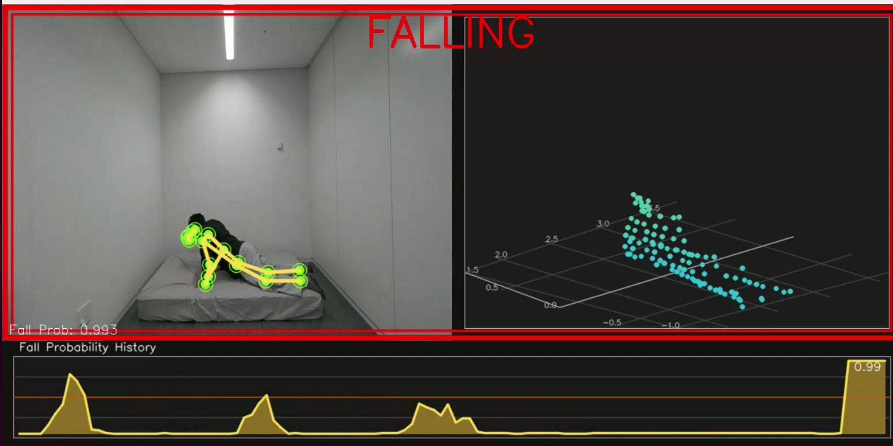
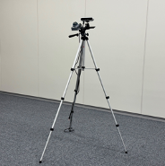
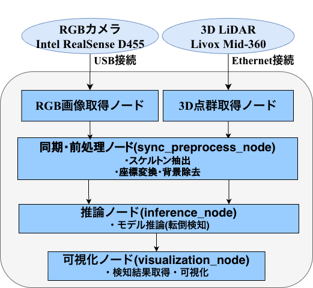

# RGBカメラ + LiDAR 転倒検知システム

RGBカメラとLiDARを用いたリアルタイム転倒検知システム



## はじめに

このシステムは、次の流れで使用する。

1. GitHub からリポジトリを clone する
2. 推論モデルを `data/checkpoints/` に配置する
3. Docker イメージをビルドする
4. 機材を接続して設定する
5. 背景モデルを取得する
6. 転倒検知システムを起動する

背景モデルは、初回導入時と、部屋レイアウトやセンサ設置位置が変わったときに再取得する。

## 前提環境

- Docker Engine / Docker Compose が使用可能であること
- NVIDIA GPU が利用可能であること
- NVIDIA Container Toolkit がセットアップ済みであること
- カメラ: Intel RealSense D455
- LiDAR: Livox MID-360



## 必要機材

- 転倒検知を実行する Linux PC
- NVIDIA GPU
- Intel RealSense D455
- Livox MID-360 
- RealSense 接続用 USB ケーブル
- Livox 接続用 LAN ケーブル
- LiDAR 用電源アダプタ(Type-C)

## ディレクトリ構成

`data/` 配下は次のように使う。

```text
data/
├── background/
│   └── background_voxel_map.npz
└── checkpoints/
    ├── camera/
    │   └── best_model.pth
    ├── lidar/
    │   └── best_model.pth
    └── fusion/
        └── best_model.pth
```

## セットアップ

### 1. GitHub から clone する

```bash
git clone <REPOSITORY_URL>
cd lcfall-ros2
```

### 2. 推論モデルを配置する

以下のコマンドでフォルダを作った後、3 つのチェックポイントをホスト側の `data/checkpoints/` に配置する。
```bash
mkdir -p data/checkpoints/camera \
         data/checkpoints/lidar \
         data/checkpoints/fusion
```

```text
data/
└── checkpoints/
    ├── camera/
    │   └── best_model.pth
    ├── lidar/
    │   └── best_model.pth
    └── fusion/
        └── best_model.pth
```

`app` 起動時に不足があれば、起動前にエラー表示して停止する。

### 3. Docker イメージをビルドする

```bash
docker compose build
```

コンテナ起動時に `lcfall_msgs` と `lcfall_ros2` は自動で `colcon build` されるため、
通常は手動ビルド不要。

### 4. センサを接続して設定する

#### センサの設置

LiDAR の背景差分と ROI は、現在の設置状態を前提に動作する。
センサ位置が変わると背景モデルを再取得する必要がある。

#### ケーブル接続

- RealSense を USB でホスト PC に接続する
- Livox MID-360 を、ホスト PC の専用有線 NIC に LAN で接続する
- Livox の電源アダプタを接続する

#### 起動前の確認

- `docker compose up app` の前に、RealSense と Livox の電源が入っていることを確認する
- RealSense はホスト側で `/dev/video*` が見えていることを確認する
- LiDAR 用 NIC は、ホスト Ubuntu 側で固定 IPv4 `192.168.1.50/24` に設定する
- 可視化を使う場合は、ホスト側の X11 が利用できる状態にする

RealSense の確認例:

```bash
ls /dev/video*
```

可視化ウィンドウが表示されない場合は、ホスト側で次を実行してから再起動する。

```bash
xhost +local:root
```

LiDAR 用 NIC の確認例:

```bash
ip addr
```

このシステムでは、LiDAR ネットワーク設定を次の固定値で運用する。

- ホスト PC 側 LiDAR 用 NIC: `192.168.1.50`
- Livox MID-360 側 IP: `192.168.1.5`

Livox ドライバ用の設定ファイルは
[config/livox/MID360_config.json](/home/user/lcfall_ws/lcfall-ros2/config/livox/MID360_config.json:1)
で管理しており、`docker compose` 起動時に自動で使用する。

### 5. 初回背景取得を行う

背景モデルは、必ず部屋に人がいない状態で取得する。

```bash
docker compose run --rm background-capture
```

完了すると、背景モデルが `data/background/background_voxel_map.npz` に保存される。

## 通常運用

### システム起動

センサドライバ、前処理、推論、可視化をまとめて起動する。

```bash
docker compose up app
```

### 可視化なしで起動

```bash
ENABLE_VISUALIZATION=false docker compose up app
```

### 停止

```bash
docker compose down
```

## 背景モデルの再取得

以下のような場合は、背景モデルを取り直す。

- 部屋のレイアウトを変更した
- カメラや LiDAR の位置、向き、高さを変更した
- 背景取得時に人や物体が動いていた
- 前景がうまく抜けず、推論に悪影響が出ている

再取得コマンド:

```bash
docker compose run --rm background-capture
```

既存の `data/background/background_voxel_map.npz` は上書きされる。

## トラブルシューティング

### 背景モデルがないと言われる

```bash
docker compose run --rm background-capture
```

部屋に人がいない状態で再取得してから、`docker compose up app` を実行する。

### checkpoint が足りないと言われる

`data/checkpoints/camera/best_model.pth`
`data/checkpoints/lidar/best_model.pth`
`data/checkpoints/fusion/best_model.pth`

上記 3 ファイルが存在するか確認する。

### 可視化ウィンドウが開かない

- ホスト側で GUI が利用可能か確認する
- `xhost +` を実行してから再起動する

### RealSense が起動しない

- USB ケーブル接続を確認する
- ホスト側で `/dev/video*` が存在するか確認する
- ほかのアプリがカメラを占有していないか確認する

### Livox が起動しない

- 電源と LAN ケーブル接続を確認する
- ホスト側 LiDAR 用 NIC が `192.168.1.50` になっているか確認する
- [config/livox/MID360_config.json](/home/user/lcfall_ws/lcfall-ros2/config/livox/MID360_config.json:1) が利用されるため、コンテナ内の Livox 設定ファイルを手で編集していないか確認する
- `lcfall.launch.py` 起動時の host IP 警告メッセージを確認する

## パラメータ調整

主要な設定は [src/lcfall_ros2/config/params.yaml](/home/user/lcfall_ws/lcfall-ros2/src/lcfall_ros2/config/params.yaml:1) にある。

### 背景取得時の主な調整項目

| パラメータ | デフォルト | 説明 |
|---|---|---|
| `capture_frames` | 200 | 蓄積フレーム数 |
| `voxel_size` | 0.05 | ボクセル 1 辺 [m] |
| `min_hits` | 5 | 背景とみなす最小出現回数 |
| `roi_x_min` 〜 `roi_z_max` | 各種 | ROI 範囲 [m] |

背景取得を一時的に上書きして実行する例:

```bash
docker compose run --rm \
  background-capture \
  ros2 launch lcfall_ros2 capture_background.launch.py \
    capture_frames:=50 \
    voxel_size:=0.08 \
    min_hits:=15
```

### 推論時の主な調整項目

| パラメータ | デフォルト | 説明 |
|---|---|---|
| `background_model_path` | `/data/background/background_voxel_map.npz` | 背景モデルパス |
| `inference_stride` | 10 | 推論間隔 |
| `fall_decision_threshold` | 0.35 | 転倒判定しきい値 |
| `camera_checkpoint_path` | `/data/checkpoints/camera/best_model.pth` | Camera 重み |
| `lidar_checkpoint_path` | `/data/checkpoints/lidar/best_model.pth` | LiDAR 重み |
| `fusion_checkpoint_path` | `/data/checkpoints/fusion/best_model.pth` | Fusion 重み |

## システム概要



## パッケージ構成

| パッケージ | 種類 | 概要 |
|---|---|---|
| `lcfall_msgs` | ament_cmake | カスタムメッセージ定義 |
| `lcfall_ros2` | ament_python | メインノード群、launch、config |

## ノード一覧

| ノード | 入力トピック | 出力トピック |
|---|---|---|
| `sync_preprocess_node` | `/camera/image_raw`, `/livox/lidar` | `/preprocessed/frame` |
| `inference_node` | `/preprocessed/frame` | `/fall_detection/result` |
| `alert_node` | `/fall_detection/result` | - |
| `visualization_node` | `/camera/image_raw`, `/livox/lidar`, `/preprocessed/frame`, `/fall_detection/result` | - |

## モデルアーキテクチャ

### Camera Branch — PoseC3D

| 項目 | 値 |
|---|---|
| backbone | `ResNet3dSlowOnly` (depth=50, in_channels=17) |
| cls_head | `I3DHead` (in_channels=512, num_classes=2) |
| 入力 | Heatmap `(B, 17, 48, 56, 56)` |
| Heatmap sigma | 0.6 |
| キーポイント | 17 点 |

### LiDAR Branch — PointNet++ + GRU

| 項目 | 値 |
|---|---|
| 空間特徴抽出 | PointNet++ 3 層 |
| 時系列学習 | GRU 2 層 |
| 入力 | `(B, 48, 256, 3)` |
| 出力特徴 | 512 次元 |

### Fusion — Late Fusion MLP

| 項目 | 値 |
|---|---|
| 入力 | Camera 512 次元 + LiDAR 512 次元 |
| 構造 | Linear(1024, 512) → BN → ReLU → Dropout → Linear(512, 2) |
| 出力 | 2 クラス |

## メッセージ定義

### PreprocessedFrame.msg

```text
std_msgs/Header header
float32[] skeleton_2d
float32[] pointcloud_frame
```

### FallDetectionResult.msg

```text
std_msgs/Header header
uint8 prediction
float32 confidence
```

## 座標変換

LiDAR センサ座標から部屋座標系への変換は、以下の回転行列で行っている。

```text
R = Rz(yaw) · Ry(pitch) · Rx(roll)
= Rz(0.0°) · Ry(27.8°) · Rx(1.1°)
```

`params.yaml` の `lidar_roll`, `lidar_pitch`, `lidar_yaw` で設定可能。

## 可視化 UI

`visualization_node` は 1 ウィンドウ内に左右 2 画面を表示する。

| 画面 | 内容 |
|---|---|
| 左 | カメラ画像 + skeleton overlay |
| 右 | 点群の投影 |
| 上部 | 転倒時のみ `FALLING` を表示 |
| 下部 | confidence 値グラフ |
